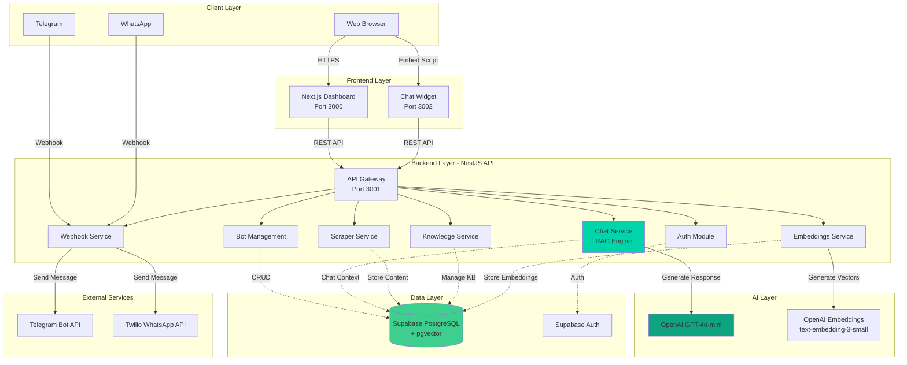
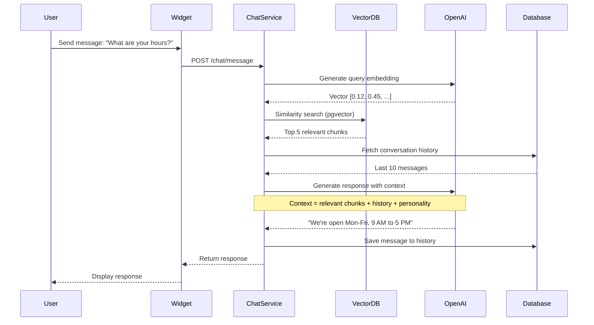

<div align="center">

# 🤖 AgentDesk

### Enterprise AI Customer Service Platform

**Build intelligent chatbots that learn from your content and engage customers across multiple channels**

[](LICENSE)
[](https://www.typescriptlang.org/)
[](https://nestjs.com/)
[](https://nextjs.org/)

[Live Demo](#) • [Documentation](#) • [API Reference](#) • [Support](#)

</div>

---


## 🎯 What is AgentDesk?

AgentDesk is a **production-ready SaaS platform** that empowers businesses to create AI-powered customer service agents without code. Built on cutting-edge RAG (Retrieval-Augmented Generation) technology, AgentDesk enables your chatbots to learn from your website, documents, and knowledge base to provide accurate, contextual responses 24/7.

### Why AgentDesk?

- 🚀 **Deploy in Minutes** - No coding required, embed on any website
- 🧠 **Learns from Your Content** - Web scraping, document ingestion, RAG-powered responses
- 🌍 **Multi-Channel Support** - Web widget, Telegram, WhatsApp integration
- 🔒 **Enterprise Security** - Multi-tenant architecture, RLS policies, encrypted data
- 📊 **Analytics Dashboard** - Track conversations, user satisfaction, and bot performance
- 🌐 **Multilingual** - Full support for English, Hebrew, and more languages

---

## ✨ Key Features

### 🧠 AI-Powered Intelligence
- **RAG (Retrieval-Augmented Generation)** - Contextual responses based on your content
- **OpenAI Integration** - GPT-4o-mini for natural conversations
- **Vector Search** - pgvector embeddings for semantic similarity matching
- **Conversation Memory** - Context-aware responses with session history

### 📚 Knowledge Management
- **Website Crawler** - Automatically scrape and index your website content
- **Document Ingestion** - Upload PDFs, text files, and documents
- **Manual Content** - Add custom FAQs and knowledge snippets
- **Automatic Chunking** - Intelligent text segmentation for optimal retrieval

### 🔗 Multi-Channel Integration
- **Web Widget** - Customizable floating chat widget for any website
- **Telegram Bots** - Connect to Telegram with one-click setup
- **WhatsApp Business** - Integrate with WhatsApp via Twilio
- **Unified Knowledge Base** - Same bot, multiple channels

### 🎨 Full Customization
- **Brand Colors** - Match your brand identity
- **Custom Personality** - Define tone and style
- **Multiple Welcome Messages** - Rotate greetings for variety
- **Multilingual UI** - RTL support for Hebrew and Arabic

### 🔐 Enterprise-Grade Security
- **Multi-Tenant Architecture** - Complete data isolation per tenant
- **Row Level Security (RLS)** - Database-level access control
- **API Token Authentication** - Secure bot-to-channel communication
- **Encrypted Storage** - AES-256 encryption at rest

### 📊 Analytics & Insights
- **Conversation Tracking** - Full chat history and analytics
- **User Metrics** - Track engagement and satisfaction
- **Knowledge Performance** - Identify gaps in your content
- **Real-Time Dashboard** - Monitor all bots from one place

---

## 🏗️ System Architecture

AgentDesk is built on a modern, scalable microservices architecture designed for reliability and performance.

### Architecture Overview



### RAG Pipeline Flow



---

## 🚀 Technology Stack

### Frontend
- **Framework**: Next.js 14 (App Router)
- **UI Library**: React 18
- **Styling**: Tailwind CSS 3
- **State Management**: React Hooks
- **Authentication**: Supabase Auth
- **Deployment**: Vercel

### Backend
- **Framework**: NestJS 10
- **Language**: TypeScript 5
- **API**: REST
- **Validation**: class-validator, class-transformer
- **Scraping**: Cheerio, Puppeteer
- **Deployment**: Render, Railway

### Database
- **Primary Database**: PostgreSQL (via Supabase)
- **Vector Search**: pgvector extension
- **Auth Provider**: Supabase Auth
- **Real-time**: Supabase Realtime (future)

### AI & ML
- **LLM**: OpenAI GPT-4o-mini
- **Embeddings**: OpenAI text-embedding-3-small
- **Vector Dimensions**: 1536
- **Similarity**: Cosine similarity

### External Integrations
- **Messaging**: Telegram Bot API, Twilio (WhatsApp)
- **Payments**: (Coming Soon)

---

## 📦 Project Structure

```
AgentDesk/
├── backend/                    # NestJS REST API
│   ├── src/
│   │   ├── auth/              # Supabase Auth integration
│   │   ├── bots/              # Bot CRUD operations
│   │   ├── chat/              # RAG chat engine
│   │   ├── embeddings/        # Vector embedding generation
│   │   ├── knowledge/         # Knowledge base management
│   │   ├── scraper/           # Web scraping (Cheerio + Puppeteer)
│   │   ├── webhooks/          # Telegram & WhatsApp webhooks
│   │   └── common/            # Shared services (Supabase client)
│   └── package.json
│
├── frontend/                   # Next.js Dashboard
│   ├── app/
│   │   ├── (auth)/            # Login & registration
│   │   ├── (dashboard)/       # Protected dashboard routes
│   │   │   └── dashboard/
│   │   │       ├── bots/      # Bot management UI
│   │   │       └── page.tsx   # Dashboard home
│   │   ├── api/               # Next.js API routes
│   │   ├── pricing/           # Pricing page
│   │   └── about/             # About page
│   ├── components/
│   │   ├── ui/                # shadcn/ui components
│   │   ├── dashboard/         # Dashboard-specific components
│   │   └── home/              # Landing page components
│   └── lib/                   # Utilities & Supabase client
│
├── widget/                     # Embeddable Chat Widget
│   ├── app/
│   │   └── page.tsx           # Widget main page
│   ├── components/
│   │   └── chat-widget.tsx    # Chat interface
│   └── public/
│       └── widget.js          # Embed script
│
├── supabase/                   # Database & Migrations
│   ├── schema.sql             # Initial schema
│   ├── migration_add_external_channels.sql
│   └── migration_add_welcome_messages.sql
│
├── docker-compose.yml          # Local PostgreSQL setup
└── package.json               # Root workspace
```

---

## 🚀 Quick Start

### Prerequisites

- **Node.js** 18+ and npm
- **Supabase Account** (free tier available)
- **OpenAI API Key** ([Get one here](https://platform.openai.com))
- **Docker** (optional, for local database)

### 1. Clone & Install

```bash
git clone https://github.com/your-org/agentdesk.git
cd AgentDesk
npm install
npm run install:all
```

### 2. Configure Environment

```bash
# Copy environment template
cp env.example .env

# Edit .env with your credentials
nano .env
```

Required variables:
```env
SUPABASE_URL=https://xxxxx.supabase.co
SUPABASE_ANON_KEY=your-anon-key
SUPABASE_SERVICE_ROLE_KEY=your-service-key
OPENAI_API_KEY=sk-your-key
```

### 3. Set Up Database

1. Create a project at [supabase.com](https://supabase.com)
2. Enable the **pgvector** extension
3. Run `supabase/schema.sql` in SQL Editor
4. Apply migrations:
   - `migration_add_external_channels.sql`
   - `migration_add_welcome_messages.sql`

### 4. Start Development

```bash
# Start all services
npm run dev

# Services will be available at:
# - Frontend:  http://localhost:3000
# - Backend:   http://localhost:3001/api
# - Widget:    http://localhost:3002
```

### 5. Create Your First Bot

1. Visit `http://localhost:3000`
2. Register a new account
3. Click **Create Bot**
4. Add knowledge from your website or documents
5. Test your bot in the preview
6. Get embed code and add to your site!

📚 **Full setup guide**: See [SETUP_GUIDE.md](./SETUP_GUIDE.md)

---

## 💼 Use Cases

### E-Commerce Support
Automate order status, shipping info, and product recommendations

### SaaS Customer Success
Onboard users, answer product questions, reduce support tickets

### Healthcare
Appointment scheduling, FAQ automation, patient pre-screening

### Education
Student support, course information, enrollment assistance

### Real Estate
Property inquiries, viewing bookings, virtual assistance

---

## 🗺️ Roadmap

### ✅ Completed (v1.0)
- ✅ Core RAG engine with OpenAI GPT-4o-mini
- ✅ pgvector semantic search
- ✅ Multi-tenant architecture with RLS
- ✅ Web scraping (Cheerio + Puppeteer)
- ✅ Embeddable chat widget
- ✅ Dashboard with bot management
- ✅ Telegram & WhatsApp integration
- ✅ Conversation history & analytics
- ✅ Multiple welcome messages
- ✅ Multilingual support (EN/HE)

### 🚧 In Progress (Q4 2025)
- 🔨 Document upload (PDF, DOCX, TXT)
- 🔨 Advanced analytics dashboard
- 🔨 Usage-based pricing & billing
- 🔨 API rate limiting per plan
- 🔨 Bot performance optimization

### 🔮 Planned (2026)
- 📅 **Q1 2026**
  - Slack & Discord integration
  - Custom AI model fine-tuning
  - A/B testing for bot responses
  - Sentiment analysis
  
- 📅 **Q2 2026**
  - Voice assistant integration
  - Multi-bot orchestration
  - Advanced conversation flows
  - Team collaboration features
  
- 📅 **Q3 2026**
  - Mobile apps (iOS & Android)
  - White-label solution
  - Enterprise SSO (SAML, OIDC)
  - Custom deployment options

- 📅 **Q4 2026**
  - AI agent marketplace
  - Integration marketplace
  - Advanced reporting & BI
  - Multi-language AI models

---

## 💰 Pricing

### 🎁 Free Trial
**7 Days - No Credit Card Required**
- Full platform access
- All features unlocked
- Up to 100 messages
- 1 bot
- Web widget only

### 💎 Pro Plan
**For Growing Businesses**
- Everything in Free Trial
- Unlimited messages
- Up to 5 bots
- All channel integrations (Telegram, WhatsApp)
- Advanced analytics
- Priority email support
- Custom branding

### 🏢 Business Plan
**For Enterprises**
- Everything in Pro
- Unlimited bots
- Dedicated account manager
- Custom AI model training
- SLA guarantee
- API access
- White-label option
- Priority phone support

**[Contact Sales](#) for custom enterprise pricing**

---

## 🔒 Security & Compliance

### Data Protection
- **Encryption at Rest**: AES-256 encryption for all stored data
- **Encryption in Transit**: TLS 1.3 for all connections
- **Database Security**: Row Level Security (RLS) policies
- **API Security**: Token-based authentication per bot

### Privacy
- **Multi-Tenant Isolation**: Complete data separation between tenants
- **Data Ownership**: You own all your data and conversations
- **GDPR Compliant**: Data deletion and export capabilities
- **SOC 2 Type II**: (In Progress)

### Infrastructure
- **Hosted on Supabase**: Enterprise-grade PostgreSQL
- **CDN**: Global edge network for low latency
- **Backups**: Daily automated backups with point-in-time recovery
- **Monitoring**: 24/7 uptime monitoring and alerting

---

## 📚 Documentation

- 📖 **[Complete Setup Guide](./SETUP_GUIDE.md)** - Step-by-step installation
- 🔧 **[Backend API Docs](./backend/README.md)** - REST API reference
- 🎨 **[Frontend Guide](./frontend/README.md)** - Dashboard development
- 🪟 **[Widget Integration](./widget/README.md)** - Embed on your site
- 🔗 **[External Channels Setup](./EXTERNAL_CHANNELS_SETUP.md)** - Telegram & WhatsApp
- 🗄️ **[Database Schema](./supabase/README.md)** - Database structure

---

## 🧪 Testing

```bash
# Backend tests
cd backend
npm run test
npm run test:e2e

# Frontend tests
cd frontend
npm run test
```

---

## 🚢 Deployment

### Recommended Stack

- **Backend**: [Render](https://render.com) or [Railway](https://railway.app)
- **Frontend**: [Vercel](https://vercel.com)
- **Widget**: [Vercel](https://vercel.com) or CDN
- **Database**: [Supabase](https://supabase.com) (managed PostgreSQL)

### Environment Variables (Production)

Update all `.env` files with production URLs:
- `NEXT_PUBLIC_API_URL` → Your backend URL
- `CORS_ORIGIN` → Your frontend domain
- Set `NODE_ENV=production`

📚 **Detailed deployment guide**: See [DEPLOYMENT.md](#) (coming soon)

---

## 🤝 Contributing

We welcome contributions! Please see our [Contributing Guide](CONTRIBUTING.md) for details.

### Development Workflow

1. Fork the repository
2. Create a feature branch: `git checkout -b feature/amazing-feature`
3. Commit changes: `git commit -m 'Add amazing feature'`
4. Push to branch: `git push origin feature/amazing-feature`
5. Open a Pull Request

---

## 📧 Support & Contact

- 🐛 **Bug Reports**: [GitHub Issues](https://github.com/your-org/agentdesk/issues)
- 💬 **Discord Community**: [Join our Discord](#)
- 📧 **Email Support**: support@agentdesk.com
- 📚 **Documentation**: [docs.agentdesk.com](#)
- 🐦 **Twitter**: [@AgentDeskAI](#)

---

## 📄 License

AgentDesk is distributed under the MIT License. This means you are free to use, modify, and distribute this software for any purpose, including commercial applications, as long as you include the original copyright notice.

For complete license terms, see the [LICENSE](LICENSE) file.

---

## 🌟 Star History

If you find AgentDesk useful, please consider giving us a ⭐ on GitHub!

---

<div align="center">

**Built with ❤️ by developers, for businesses worldwide**

[Get Started](#-quick-start) • [Live Demo](#) • [Documentation](#)

© 2025 AgentDesk. All rights reserved.

</div>
