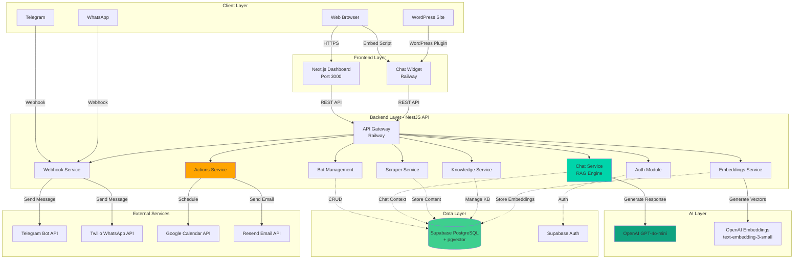
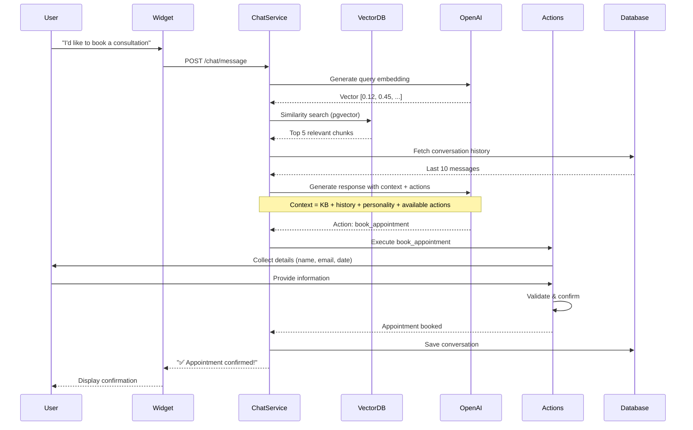

<div align="center">

# 🤖 AgentDesk

### **Enterprise AI Agent Platform - Not Just a Chatbot!**

**Build intelligent AI agents that learn, act, and engage customers across every channel**

[](https://agentdesk-frontend-production.up.railway.app/)
[](LICENSE)
[](https://www.typescriptlang.org/)
[](https://nestjs.com/)
[](https://nextjs.org/)

[🚀 Live Demo](https://agentdesk-frontend-production.up.railway.app/) • [📚 Documentation](#-documentation) • [⚡ Quick Start](#-quick-start)

</div>

---


## 🎯 What is AgentDesk?

AgentDesk is not just another chatbot platform. It's a **production-ready AI Agent system** that empowers businesses to create intelligent customer service agents that don't just answer questions—they take action.

### Why AI Agent, Not Just a Bot?

- 🧠 **Learns** from your website, documents, and knowledge base using RAG
- 💪 **Acts** - Books appointments, captures leads, sends emails automatically
- 🤔 **Thinks** - Context-aware responses with conversation memory
- 🌍 **Connects** - WordPress, Telegram, WhatsApp, and any website
- 🎨 **Adapts** - Hebrew, English, RTL support, fully customizable
- 🔐 **Scales** - Enterprise-grade security, multi-tenant architecture

**It's an AI agent that works for you 24/7, not just a scripted chatbot!** ✨

---

## ✨ Key Features

### 🧠 AI-Powered Intelligence
- **RAG (Retrieval-Augmented Generation)** - Contextual responses based on your content
- **OpenAI GPT-4o-mini** - Natural, human-like conversations
- **pgvector Semantic Search** - Find relevant information instantly with vector embeddings
- **Conversation Memory** - Context-aware responses with full session history
- **Multi-turn Conversations** - Maintains context across entire conversation

### 🚀 AI Agent Actions & Automation
- **📅 Appointment Scheduling** - Direct Google Calendar integration with smart booking
- **📧 Email Automation** - Confirmation emails and notifications via Resend
- **🎯 Lead Capture** - Automatic lead collection with validation and follow-ups
- **✅ Smart Validation** - Email format checking and detail confirmation
- **🔧 Extensible Actions** - Add custom actions via OpenAI Function Calling
- **🤖 Multi-step Workflows** - Complex task automation with user confirmation

### 📚 Knowledge Management
- **🔍 Website Crawler** - Automatically scrape and index your website content
- **📄 Document Ingestion** - Upload PDFs, text files, and documents _(coming soon)_
- **✍️ Manual Content** - Add custom FAQs and knowledge snippets
- **🔄 Automatic Chunking** - Intelligent text segmentation for optimal retrieval
- **🔄 Auto-sync** - Keep knowledge base updated with content changes

### 🌐 Multi-Channel Integration
- **🌐 Web Widget** - Customizable floating chat widget for any website
- **🔌 WordPress Plugin v1.2.0** - One-click installation with auto-updates
  - Real-time update notifications
  - One-click updates without plugin deactivation
  - Full Hebrew/RTL support
  - Connection status in dashboard
  - Bot training status display
- **📱 Telegram Bots** - Connect to Telegram with one-click setup
- **💬 WhatsApp Business** - Integrate with WhatsApp via Twilio
- **🔗 Unified Knowledge Base** - Same agent, multiple channels

### 🎨 Full Customization
- **🎨 Brand Colors** - Match your brand identity perfectly
- **🗣️ Custom Personality** - Define tone, style, and behavior
- **💬 Multiple Welcome Messages** - Rotate greetings for variety and engagement
- **🌍 Multilingual UI** - Full RTL support for Hebrew and Arabic
- **📍 Widget Positioning** - Choose where the widget appears on your site

### 🔐 Enterprise-Grade Security
- **🔒 Multi-Tenant Architecture** - Complete data isolation per tenant
- **🛡️ Row Level Security (RLS)** - Database-level access control
- **🔑 API Token Authentication** - Secure bot-to-channel communication
- **🌐 Domain Validation** - Restrict bot usage to authorized domains only
- **🔐 Encrypted Storage** - AES-256 encryption at rest
- **📊 Audit Logs** - Track all bot interactions and changes

### 📊 Analytics & Insights
- **💬 Conversation Tracking** - Full chat history and analytics
- **👥 User Metrics** - Track engagement and satisfaction
- **📈 Knowledge Performance** - Identify gaps in your content
- **🎯 Real-Time Dashboard** - Monitor all bots from one place
- **📉 Response Quality** - Measure accuracy and user satisfaction

---

## 🏗️ System Architecture

AgentDesk is built on a modern, scalable microservices architecture designed for reliability and performance.

### Architecture Overview



### RAG Pipeline Flow



---

## 🚀 Technology Stack

### Frontend
- **Framework**: Next.js 14 (App Router)
- **UI Library**: React 18
- **Styling**: Tailwind CSS 3
- **Components**: shadcn/ui
- **State Management**: React Hooks
- **Authentication**: Supabase Auth
- **Deployment**: Vercel

### Backend
- **Framework**: NestJS 10
- **Language**: TypeScript 5
- **API**: REST
- **Validation**: class-validator, class-transformer
- **Scraping**: Cheerio, Puppeteer
- **Deployment**: Railway

### Database
- **Primary Database**: PostgreSQL (via Supabase)
- **Vector Search**: pgvector extension
- **Auth Provider**: Supabase Auth
- **Real-time**: Supabase Realtime

### AI & ML
- **LLM**: OpenAI GPT-4o-mini
- **Embeddings**: OpenAI text-embedding-3-small (1536 dimensions)
- **Vector Similarity**: Cosine similarity
- **Function Calling**: OpenAI Function Calling for actions

### External Integrations
- **Messaging**: Telegram Bot API, Twilio (WhatsApp)
- **Calendar**: Google Calendar API (OAuth 2.0)
- **Email**: Resend API (100 emails/day free tier)
- **WordPress**: Custom plugin with auto-update system

---

## 📦 Project Structure

```
AgentDesk/
├── backend/                    # NestJS REST API
│   ├── src/
│   │   ├── auth/              # Supabase Auth integration
│   │   ├── bots/              # Bot CRUD operations & config
│   │   ├── chat/              # RAG chat engine with GPT-4o
│   │   ├── actions/           # Bot actions & integrations
│   │   │   ├── integrations/  # Calendar, Email services
│   │   │   └── function-definitions.ts
│   │   ├── embeddings/        # Vector embedding generation
│   │   ├── knowledge/         # Knowledge base management
│   │   ├── scraper/           # Web scraping (Cheerio + Puppeteer)
│   │   ├── webhooks/          # Telegram & WhatsApp webhooks
│   │   ├── wordpress/         # WordPress plugin update API
│   │   └── common/            # Shared services (Supabase client)
│   └── migrations/            # SQL migrations
│
├── frontend/                   # Next.js Dashboard
│   ├── app/
│   │   ├── (auth)/            # Login & registration pages
│   │   ├── (dashboard)/       # Protected dashboard routes
│   │   │   └── dashboard/
│   │   │       ├── bots/      # Bot management UI
│   │   │       └── page.tsx   # Dashboard home
│   │   ├── pricing/           # Pricing page
│   │   └── about/             # About page
│   ├── components/
│   │   ├── ui/                # shadcn/ui components
│   │   ├── dashboard/         # Dashboard-specific components
│   │   └── home/              # Landing page components
│   └── lib/                   # Utilities & Supabase client
│
├── widget/                     # Embeddable Chat Widget
│   ├── app/
│   │   └── page.tsx           # Widget main page
│   ├── components/
│   │   └── chat-widget.tsx    # Chat interface
│   └── public/
│       └── widget.js          # Embed script
│
├── supabase/                   # Database & Migrations
│   ├── schema.sql             # Initial schema with RLS
│   └── migrations/
│       ├── add_external_channels.sql
│       ├── add_welcome_messages.sql
│       ├── add_trial_tracking.sql
│       └── add_actions_system.sql
│
├── wordpress-plugin/           # WordPress Integration
│   ├── agentdesk-chatbot.php  # Main plugin file (v1.2.0)
│   ├── includes/              # Plugin core functionality
│   │   ├── class-agentdesk-admin.php
│   │   ├── class-agentdesk-widget.php
│   │   ├── class-agentdesk-validator.php
│   │   └── class-agentdesk-updater.php  # Auto-update system
│   ├── assets/                # CSS & JS files
│   ├── languages/             # Hebrew translations (he_IL)
│   └── readme.txt             # WordPress.org plugin readme
│
└── private_docs/              # Private documentation (not in repo)
```

---

## ⚡ Quick Start

### Prerequisites

- **Node.js** 18+ and npm
- **Supabase Account** (free tier available)
- **OpenAI API Key** ([Get one here](https://platform.openai.com))
- **Docker** (optional, for local database)

**Optional (for bot actions):**
- **Google Cloud Account** (for Calendar integration)
- **Resend Account** (for email notifications - 100/day free)

### 1. Clone & Install

```bash
git clone https://github.com/michalwilman/AgentDesk.git
cd AgentDesk

# Install all dependencies
npm install
npm run install:all
```

### 2. Configure Environment

```bash
# Copy environment template
cp env.example .env

# Edit with your credentials
nano .env
```

Required variables:
```env
# Database
SUPABASE_URL=https://xxxxx.supabase.co
SUPABASE_ANON_KEY=your-anon-key
SUPABASE_SERVICE_ROLE_KEY=your-service-key

# AI
OPENAI_API_KEY=sk-your-key

# Optional: Bot Actions
GOOGLE_CLIENT_ID=your-client-id
GOOGLE_CLIENT_SECRET=your-client-secret
RESEND_API_KEY=re_your_api_key
```

### 3. Set Up Database

1. Create a project at [supabase.com](https://supabase.com)
2. Enable the **pgvector** extension in SQL Editor:
   ```sql
   CREATE EXTENSION IF NOT EXISTS vector;
   ```
3. Run `supabase/schema.sql` in SQL Editor
4. Apply migrations from `supabase/migrations/`

### 4. Start Development

```bash
# Start all services
npm run dev

# Services will be available at:
# - Frontend:  http://localhost:3000
# - Backend:   http://localhost:3001/api
# - Widget:    http://localhost:3002
```

### 5. Create Your First AI Agent

1. Visit `http://localhost:3000`
2. Register a new account
3. Click **Create Bot**
4. Add knowledge from your website or documents
5. Enable actions (appointments, leads)
6. Test your agent in the preview
7. Get embed code and add to your site!

---

## 🔌 WordPress Integration

AgentDesk includes a production-ready WordPress plugin with full Hebrew and RTL support.

### Quick Install

1. Download `wordpress-plugin/agentdesk-chatbot.zip`
2. Upload to WordPress: **Plugins → Add New → Upload Plugin**
3. Activate the plugin
4. Go to **Settings → AgentDesk**
5. Enter your Bot Token (from AgentDesk dashboard)
6. Save settings - your AI agent is now live! ✅

### Features

- ✅ **One-click auto-updates** - Update plugin without deactivation
- ✅ **Real-time status** - See bot connection and training status
- ✅ **Full Hebrew & RTL support** - Perfect for Hebrew websites
- ✅ **No coding required** - Configure everything in WordPress admin
- ✅ **Domain security** - Restrict bot usage to your domain
- ✅ **Display rules** - Control where the widget appears

**Plugin version:** 1.2.0 (November 2025)

---

## 🎯 AI Agent Actions Setup

Enable your AI agent to perform real actions like scheduling appointments and capturing leads.

### Appointment Scheduling (Google Calendar)

**1. Create Google Cloud Project**
- Visit [Google Cloud Console](https://console.cloud.google.com)
- Create new project
- Enable Google Calendar API

**2. Create OAuth Credentials**
- Go to APIs & Services → Credentials
- Create OAuth 2.0 Client ID (Web application)
- Add authorized redirect URI: `https://your-backend.com/api/google-oauth/callback`

**3. Configure Backend**
```bash
# Add to backend/.env
GOOGLE_CLIENT_ID=your-client-id.apps.googleusercontent.com
GOOGLE_CLIENT_SECRET=your-client-secret
GOOGLE_REDIRECT_URI=https://your-backend.com/api/google-oauth/callback
```

**4. Connect in Dashboard**
- Go to Bot Settings → Actions
- Toggle "Enable Appointments"
- Click "Connect Google Calendar"
- Authorize access
- ✅ Your agent can now schedule appointments!

### Email Notifications (Resend)

**1. Sign Up for Resend**
- Visit [resend.com](https://resend.com)
- Create free account (100 emails/day)

**2. Get API Key**
- Go to API Keys in dashboard
- Create new API key
- Copy the key (starts with `re_`)

**3. Configure Backend**
```bash
# Add to backend/.env
RESEND_API_KEY=re_your_api_key_here
DEFAULT_FROM_EMAIL=onboarding@resend.dev
```

### Example Conversation Flow

```
Customer: "I'd like to book a consultation"
Agent: "I'd be happy to help! What's your full name?"
Customer: "Sarah Cohen"
Agent: "Great! What's your email address?"
Customer: "sarah@example.com"
Agent: "And your phone number?"
Customer: "+972-50-123-4567"
Agent: "When would you like to schedule it?"
Customer: "Tomorrow at 2pm"
Agent: "Perfect! Let me confirm:
     - Name: Sarah Cohen
     - Email: sarah@example.com
     - Phone: +972-50-123-4567
     - Date: November 4, 2025 at 2:00 PM
     Are these details correct?"
Customer: "Yes"
Agent: "✅ Your appointment has been scheduled!
     The event has been added to the calendar, and
     you'll receive a confirmation email shortly."
```

---

## 💼 Use Cases

### E-Commerce Support
Automate order status, shipping info, and product recommendations with smart product search

### SaaS Customer Success
Onboard users, answer product questions, schedule demos, reduce support tickets by 70%

### Healthcare
Appointment scheduling, FAQ automation, patient pre-screening, HIPAA-compliant conversations

### Education
Student support, course information, enrollment assistance, 24/7 availability for students

### Real Estate
Property inquiries, viewing bookings, virtual assistance, lead qualification and nurturing

### Professional Services
Consultation booking, service inquiries, client intake, automated follow-ups

---

## 🗺️ Roadmap

### ✅ Completed (v1.2.0 - Production Ready)
- ✅ Core RAG engine with OpenAI GPT-4o-mini
- ✅ pgvector semantic search with 1536-dim embeddings
- ✅ Multi-tenant architecture with RLS policies
- ✅ Web scraping (Cheerio + Puppeteer)
- ✅ Embeddable chat widget with customization
- ✅ Next.js dashboard with bot management
- ✅ Telegram & WhatsApp integration
- ✅ Conversation history & analytics
- ✅ Multiple welcome messages
- ✅ Multilingual support (EN/HE with RTL)
- ✅ WordPress plugin v1.2.0 with auto-updates
- ✅ AI Agent Actions (Calendar, Email, Leads)
- ✅ Google Calendar OAuth integration
- ✅ Resend email notifications
- ✅ Domain security validation
- ✅ Railway + Vercel deployment
- ✅ 7-day free trial system

### 🚧 In Progress (Q4 2025)
- 🔨 Document upload (PDF, DOCX, TXT)
- 🔨 Advanced analytics dashboard
- 🔨 Usage-based pricing & billing
- 🔨 API rate limiting per plan
- 🔨 Bot performance optimization

### 🔮 Planned (2026)
- 📅 **Q1 2026**
  - Slack & Discord integration
  - Custom AI model fine-tuning
  - A/B testing for bot responses
  - Sentiment analysis
  
- 📅 **Q2 2026**
  - Voice assistant integration
  - Multi-bot orchestration
  - Advanced conversation flows with branches
  - Team collaboration features
  
- 📅 **Q3 2026**
  - Mobile apps (iOS & Android)
  - White-label solution for agencies
  - Enterprise SSO (SAML, OIDC)
  - Custom deployment options (on-premise)

- 📅 **Q4 2026**
  - AI agent marketplace
  - Integration marketplace
  - Advanced reporting & BI
  - Multi-language AI models

---

## 💰 Pricing

### 🎁 Free Trial
**7 Days - No Credit Card Required**
- Full platform access
- All features unlocked
- Up to 100 messages
- 1 bot
- Web widget only

### 💎 Pro Plan
**$49/month - For Growing Businesses**
- Everything in Free Trial
- Unlimited messages
- Up to 5 bots
- All channel integrations (Telegram, WhatsApp)
- AI Agent Actions (Calendar, Email)
- Advanced analytics
- Priority email support
- Custom branding

### 🏢 Enterprise Plan
**Custom Pricing - For Large Organizations**
- Everything in Pro
- Unlimited bots
- Dedicated account manager
- Custom AI model training
- SLA guarantee (99.9% uptime)
- API access
- White-label option
- Priority phone support
- Custom deployment options

**[Contact Sales](mailto:sales@agentdesk.com) for custom enterprise pricing**

---

## 🔒 Security & Compliance

### Data Protection
- **Encryption at Rest**: AES-256 encryption for all stored data
- **Encryption in Transit**: TLS 1.3 for all connections
- **Database Security**: Row Level Security (RLS) policies in PostgreSQL
- **API Security**: Token-based authentication per bot with domain validation

### Privacy
- **Multi-Tenant Isolation**: Complete data separation between tenants
- **Data Ownership**: You own all your data and conversations
- **GDPR Compliant**: Data deletion and export capabilities
- **Data Retention**: Configurable retention policies
- **SOC 2 Type II**: (In Progress)

### Infrastructure
- **Hosted on Supabase**: Enterprise-grade PostgreSQL with 99.9% uptime
- **CDN**: Global edge network for low latency widget delivery
- **Backups**: Daily automated backups with 30-day retention
- **Monitoring**: 24/7 uptime monitoring with alerting
- **DDoS Protection**: Cloudflare protection on all endpoints

---

## 📚 Documentation

- 📖 [Backend Guide](./backend/README.md) - Backend development & architecture
- 🎨 [Frontend Guide](./frontend/README.md) - Dashboard development
- 🪟 [Widget Integration](./widget/README.md) - Embed widget on your site
- 🗄️ [Database Schema](./supabase/README.md) - Database structure & migrations
- 🔌 [WordPress Plugin Guide](./wordpress-plugin/README.md) - WordPress integration

**Private Documentation** (for contributors):
- See `private_docs/` for setup guides, deployment instructions, and troubleshooting

---

## 🧪 Testing

```bash
# Backend tests
cd backend
npm run test
npm run test:e2e

# Frontend tests
cd frontend
npm run test
```

---

## 🚢 Deployment

### Recommended Stack

- **Backend**: [Railway](https://railway.app) (currently deployed)
- **Frontend**: [Vercel](https://vercel.com) (currently deployed)
- **Widget**: Railway (currently deployed)
- **Database**: [Supabase](https://supabase.com) (managed PostgreSQL)

### Current Production URLs

- **Dashboard**: https://agentdesk-frontend-production.up.railway.app/
- **Backend API**: https://agentdesk-backend-production.up.railway.app/api
- **Widget**: https://agentdesk-widget-production.up.railway.app/
- **Demo Bot**: Visit [tirufai.com](https://tirufai.com) to see it in action

### Environment Variables (Production)

Key production environment variables:
```env
NODE_ENV=production
NEXT_PUBLIC_API_URL=https://agentdesk-backend-production.up.railway.app/api
FRONTEND_URL=https://agentdesk-frontend-production.up.railway.app
WP_PLUGIN_VERSION=1.2.0
```

---

## 🌟 Live Demo

### Try it Now

**Dashboard**: [https://agentdesk-frontend-production.up.railway.app/](https://agentdesk-frontend-production.up.railway.app/)

**See it in Action**: Visit [tirufai.com](https://tirufai.com) to interact with a live AI agent powered by AgentDesk!

### What You Can Test

- 💬 Natural conversation with RAG-powered responses
- 🇮🇱 Hebrew language support with RTL layout
- 🎨 Custom branding and colors
- 📅 Appointment booking (if enabled)
- 🔍 Knowledge base search and retrieval

---

## 🤝 Contributing

We welcome contributions! Whether it's bug fixes, new features, or documentation improvements.

### Development Workflow

1. Fork the repository
2. Create a feature branch: `git checkout -b feature/amazing-feature`
3. Commit changes: `git commit -m 'Add amazing feature'`
4. Push to branch: `git push origin feature/amazing-feature`
5. Open a Pull Request

### Code Style

- TypeScript with strict mode
- ESLint + Prettier for formatting
- Conventional commits for commit messages

---

## 🌟 Star History

If you find AgentDesk useful, please consider giving us a ⭐ on GitHub!

**Why star us?**
- 🚀 Helps others discover the project
- 💪 Motivates continued development
- 🎯 Shows community support
- 📈 Contributes to open-source AI ecosystem

[](https://star-history.com/#michalwilman/AgentDesk&Date)

---

## 📄 License

AgentDesk is distributed under the **MIT License**. This means you are free to use, modify, and distribute this software for any purpose, including commercial applications, as long as you include the original copyright notice.

### What this means for you:

- ✅ **Commercial Use** - Use in commercial projects without restrictions
- ✅ **Modification** - Modify and customize freely
- ✅ **Distribution** - Distribute and sell your modifications
- ✅ **Private Use** - Use privately in your organization
- ℹ️ **Attribution Required** - Must include license and copyright notice
- ℹ️ **No Liability** - Provided "as is" without warranty

For complete license terms, see the [LICENSE](LICENSE) file.

---

## 📧 Support & Contact

- 🐛 **Bug Reports**: [GitHub Issues](https://github.com/michalwilman/AgentDesk/issues)
- 💬 **Discussions**: [GitHub Discussions](https://github.com/michalwilman/AgentDesk/discussions)
- 📧 **Email Support**: support@agentdesk.com
- 🐦 **Twitter**: [@AgentDeskAI](https://twitter.com/AgentDeskAI)

**For Enterprise inquiries**: [sales@agentdesk.com](mailto:sales@agentdesk.com)

---

<div align="center">

**Built with ❤️ in Israel**

**AgentDesk - Where AI Meets Action** 🚀

[Get Started](#-quick-start) • [Live Demo](https://agentdesk-frontend-production.up.railway.app/) • [⭐ Star on GitHub](https://github.com/michalwilman/AgentDesk)

© 2025 AgentDesk. All rights reserved.

</div>
