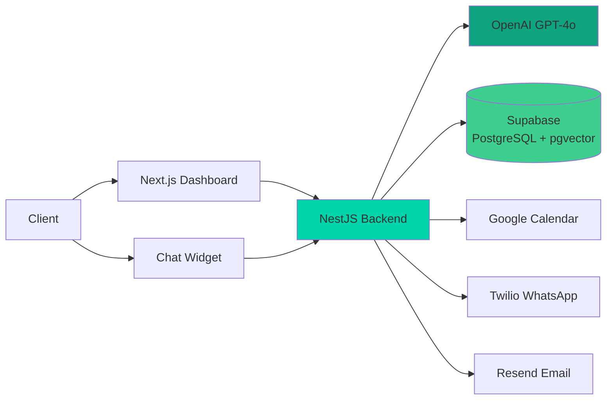

<div align="center">

# 🤖 AgentDesk

### **Enterprise AI Agent Platform - Where AI Meets Action**

Build intelligent AI agents that don't just chat—they learn, act, and engage customers 24/7 across every channel.

[](https://agentdesk-frontend-production.up.railway.app/)
[](LICENSE)
[](https://www.typescriptlang.org/)
[](https://nestjs.com/)
[](https://nextjs.org/)

[🚀 Live Demo](https://agentdesk-frontend-production.up.railway.app/) • [📚 Docs](#-documentation) • [⚡ Quick Start](#-quick-start)

</div>

---


## 🎯 What Makes AgentDesk Different?

AgentDesk isn't just another chatbot. It's a **production-ready AI Agent** that takes action on behalf of your business.

| Traditional Chatbots | AgentDesk AI Agents |
|---------------------|---------------------|
| 🤖 Scripted responses | 🧠 **Learns** from your content (RAG) |
| 💬 Just answers questions | 💪 **Acts** - Books meetings, captures leads |
| 🔄 Forgets context | 🤔 **Remembers** - Full conversation memory |
| 🌐 Website only | 🚀 **Everywhere** - Web, Telegram, WhatsApp |
| 🎲 One-size-fits-all | 🎨 **Adapts** - Custom personality & brand |

**Built for scale.** Multi-tenant architecture • Enterprise security • Production-ready.

---

## ✨ Core Features

<details>
<summary><b>🧠 RAG-Powered Intelligence</b> - Click to expand</summary>

- **Semantic Search** with pgvector (1536-dim embeddings)
- **GPT-4o-mini** for natural conversations
- **Conversation Memory** - Context across entire chat history
- **Website Scraper** - Auto-index your content (Cheerio + Puppeteer)
- **Multi-source Knowledge** - Websites, docs, manual FAQs
- **Real-time Learning** - Updates knowledge base automatically
</details>

<details>
<summary><b>💪 AI Agent Actions</b> - Click to expand</summary>

- 📅 **Appointment Scheduling** - Google Calendar integration with OAuth 2.0
- 📧 **Email Automation** - Confirmation & notifications via Resend API
- 💬 **WhatsApp Business** - Twilio integration with Message Templates
- 📱 **SMS Fallback** - Automatic SMS if WhatsApp unavailable
- 🎯 **Lead Capture** - Smart validation & automated follow-ups
- 🔄 **Multi-step Workflows** - Complex task automation with user confirmation
- 🔗 **Extensible Actions** - Add custom actions via OpenAI Function Calling
</details>

<details>
<summary><b>🌐 Multi-Channel Deployment</b> - Click to expand</summary>

- **🌐 Web Widget** - Embeddable on any website with customization
- **🔌 WordPress Plugin v1.2.0** - One-click install with auto-updates
- **📱 Telegram** - Native bot integration with webhook support
- **💬 WhatsApp Business** - Direct customer messaging via Twilio
- **🔗 Unified Knowledge Base** - One agent, multiple channels
- **🎨 Brand Customization** - Colors, personality, welcome messages
</details>

<details>
<summary><b>📊 Analytics & Usage Tracking</b> - Click to expand</summary>

- **Real-time Dashboard** - Monitor conversations & performance
- **Usage Analytics** - Track bots, messages, WhatsApp sends
- **Plan Limits Display** - Visual progress bars with color-coded alerts
- **Conversation History** - Full audit trail & export capabilities
- **Performance Metrics** - Response times, user satisfaction
- **Knowledge Gap Analysis** - Identify missing content
</details>

<details>
<summary><b>💳 Subscription Management</b> - Click to expand</summary>

- **4 Pricing Tiers** - Starter, Growth, Plus, Premium
- **7-Day Free Trial** - No credit card required, full feature access
- **Trial Countdown** - Real-time expiration tracking in header
- **Automated Email Reminders** - Days 3, 1, 0 before expiration
- **Feature Gating** - Enforce limits per plan automatically
- **Usage Dashboard** - Collapsible view of limits vs. current usage
- **Plan Enforcement** - Backend + Frontend validation
</details>

<details>
<summary><b>🔐 Enterprise Security</b> - Click to expand</summary>

- **Multi-Tenant RLS** - Complete data isolation at database level
- **Bot Token Auth** - Secure API access per bot
- **Domain Validation** - Restrict bot usage to authorized domains
- **Encrypted Storage** - AES-256 encryption at rest
- **TLS 1.3** - Encryption in transit
- **Audit Logs** - Track all bot interactions and changes
- **Row Level Security** - PostgreSQL RLS policies
</details>

---

## 🏗️ Architecture



<details>
<summary><b>📚 Tech Stack Details</b> - Click to expand</summary>

**Frontend:**
- Framework: Next.js 14 (App Router)
- UI Library: React 18
- Styling: Tailwind CSS 3
- Components: shadcn/ui
- Auth: Supabase Auth
- Deployment: Vercel

**Backend:**
- Framework: NestJS 10
- Language: TypeScript 5
- API: REST
- Scraping: Cheerio, Puppeteer
- Deployment: Railway

**Database:**
- Primary: PostgreSQL (Supabase)
- Vector Search: pgvector extension
- Auth: Supabase Auth
- Real-time: Supabase Realtime

**AI & ML:**
- LLM: OpenAI GPT-4o-mini
- Embeddings: text-embedding-3-small (1536 dims)
- Similarity: Cosine similarity
- Actions: OpenAI Function Calling

**Integrations:**
- Messaging: Telegram Bot API, Twilio WhatsApp
- Calendar: Google Calendar API (OAuth 2.0)
- Email: Resend API
- WordPress: Custom plugin with auto-update system
</details>

---

## ⚡ Quick Start

<details>
<summary><b>📋 Prerequisites</b> - Click to expand</summary>

**Required:**
- Node.js 18+
- Supabase Account (free tier available)
- OpenAI API Key ([Get one here](https://platform.openai.com))

**Optional (for bot actions):**
- Google Cloud Account (for Calendar integration)
- Twilio Account (for WhatsApp)
- Resend Account (for email - 100/day free)
</details>

<details>
<summary><b>🚀 Installation Steps</b> - Click to expand</summary>

### 1. Clone & Install
```bash
git clone https://github.com/michalwilman/AgentDesk.git
cd AgentDesk
npm run install:all
```

### 2. Configure Environment
```bash
cp env.example .env
```

```env
# Database
SUPABASE_URL=https://xxxxx.supabase.co
SUPABASE_ANON_KEY=your-anon-key
SUPABASE_SERVICE_ROLE_KEY=your-service-key

# AI
OPENAI_API_KEY=sk-your-key

# Optional: Actions
GOOGLE_CLIENT_ID=your-client-id
GOOGLE_CLIENT_SECRET=your-secret
RESEND_API_KEY=re_your_key
TWILIO_ACCOUNT_SID=your-sid
TWILIO_AUTH_TOKEN=your-token
TWILIO_WHATSAPP_FROM=whatsapp:+14155238886
```

### 3. Database Setup
1. Create project at [supabase.com](https://supabase.com)
2. Enable pgvector extension:
   ```sql
   CREATE EXTENSION IF NOT EXISTS vector;
   ```
3. Run `supabase/schema.sql` in SQL Editor
4. Apply all migrations from `supabase/migrations/`

### 4. Start Development
```bash
npm run dev

# Services:
# Frontend:  http://localhost:3000
# Backend:   http://localhost:3001/api
# Widget:    http://localhost:3002
```

### 5. Create Your First Agent
1. Visit `http://localhost:3000` → Register
2. **Create Bot** → Add website URL or content
3. **Configure Actions** → Enable appointments, leads
4. **Test in Preview** → Chat with your agent
5. **Get Embed Code** → Add to your website!
</details>

---

## 🔌 WordPress Integration

<details>
<summary><b>🔌 WordPress Plugin - Full Installation Guide</b> - Click to expand</summary>

Production-ready plugin with full Hebrew & RTL support.

### Quick Install
1. Download `wordpress-plugin/agentdesk-chatbot.zip`
2. Upload to WordPress: **Plugins → Add New → Upload**
3. Activate plugin
4. Go to **Settings → AgentDesk**
5. Enter your Bot Token (from AgentDesk dashboard)
6. Save settings - ✅ Live in 60 seconds!

### Features
- ✅ **One-click auto-updates** - Update without deactivation
- ✅ **Full Hebrew & RTL support** - Perfect for Hebrew sites
- ✅ **Real-time connection status** - See bot health in dashboard
- ✅ **Bot training status** - Know when knowledge is ready
- ✅ **Domain security** - Restrict to your domain only
- ✅ **Display rules** - Control where widget appears
- ✅ **Zero coding required** - Configure in WordPress admin

**Plugin Version:** 1.2.0 (November 2025)

**WordPress Requirements:** 5.0+, PHP 7.4+
</details>

---

## 💰 Pricing Plans

<details>
<summary><b>💳 View All Pricing Tiers</b> - Click to expand</summary>

### 🎁 **Starter** - $24.17/mo
Perfect for small businesses getting started with AI

**Limits:**
- 1 AI Agent
- 100 conversations/month
- 500 WhatsApp messages/month

**Features:**
- Web widget
- Email notifications
- Lead capture
- Basic analytics
- Community support

---

### 🚀 **Growth** - $49.17/mo
For growing businesses scaling customer engagement

**Limits:**
- 3 AI Agents
- 500 conversations/month
- 2,000 WhatsApp messages/month

**Features:**
- Everything in Starter, plus:
- All channels (Telegram, WhatsApp)
- Google Calendar sync
- Appointment reminders
- Advanced analytics
- Priority email support

---

### 💎 **Plus** - $749/mo
For established businesses with high volume

**Limits:**
- 10 AI Agents
- 5,000 conversations/month
- 10,000 WhatsApp messages/month

**Features:**
- Everything in Growth, plus:
- Remove AgentDesk branding
- Webhook integrations
- Custom branding
- Multiple team members
- API access
- Dedicated account manager

---

### 🏢 **Premium** - Custom Pricing
Enterprise solution with unlimited everything

**Limits:**
- ∞ Unlimited AI Agents
- ∞ Unlimited conversations
- ∞ Unlimited WhatsApp messages

**Features:**
- Everything in Plus, plus:
- Bring your own Twilio account
- SLA guarantee (99.9% uptime)
- 24/7 priority phone support
- Custom deployment options
- White-label solution
- Custom AI model training

**[Contact Sales](mailto:sales@agentdesk.com)** for enterprise pricing

---

### 🎁 **7-Day Free Trial**
No credit card required • All features unlocked • Cancel anytime
</details>

---

## 💼 Use Cases

**E-Commerce** • Order status, shipping info, product recommendations  
**SaaS** • User onboarding, product questions, demo scheduling  
**Healthcare** • Appointment scheduling, patient pre-screening  
**Real Estate** • Property inquiries, viewing bookings, lead qualification  
**Professional Services** • Consultation booking, client intake, automated follow-ups  

---

## 🚢 Deployment

<details>
<summary><b>🌐 Production Deployment Guide</b> - Click to expand</summary>

### Current Production Stack
- **Backend:** [Railway](https://railway.app)
- **Frontend:** [Vercel](https://vercel.com)
- **Database:** [Supabase](https://supabase.com)

### Production URLs
- **Dashboard:** https://agentdesk-frontend-production.up.railway.app/
- **Backend API:** https://agentdesk-backend-production.up.railway.app/api
- **Widget:** https://agentdesk-widget-production.up.railway.app/

**Live Demo:** See it in action at [tirufai.com](https://tirufai.com)

### Environment Variables
```env
NODE_ENV=production
NEXT_PUBLIC_API_URL=https://your-backend.up.railway.app/api
FRONTEND_URL=https://your-frontend.vercel.app
WP_PLUGIN_VERSION=1.2.0
```

### Deployment Steps
1. **Backend:** Connect Railway to GitHub → Deploy
2. **Frontend:** Connect Vercel to GitHub → Deploy
3. **Database:** Already hosted on Supabase
4. **Widget:** Deploy to Railway alongside backend
5. **Configure:** Update environment variables
</details>

---

## 🗺️ Roadmap

<details>
<summary><b>📅 Completed & Planned Features</b> - Click to expand</summary>

### ✅ Completed (v1.2.0 - November 2025)
- ✅ Core RAG engine with pgvector semantic search
- ✅ Multi-channel deployment (Web, Telegram, WhatsApp)
- ✅ AI Agent Actions (Calendar, Email, WhatsApp Business)
- ✅ WordPress plugin v1.2.0 with auto-updates
- ✅ Subscription management (4 tiers: Starter, Growth, Plus, Premium)
- ✅ 7-day trial system with automated email reminders
- ✅ Usage tracking & plan limit enforcement
- ✅ Multi-tenant architecture with Row Level Security
- ✅ Full Hebrew & RTL support
- ✅ Google Calendar OAuth integration
- ✅ Twilio WhatsApp Business API integration
- ✅ Resend email automation

### 🚧 In Progress (Q4 2025)
- 🔨 Document upload (PDF, DOCX, TXT)
- 🔨 Advanced analytics dashboard
- 🔨 Stripe payment integration
- 🔨 Bot performance optimization

### 🔮 Planned (2026)
- **Q1 2026:** Slack & Discord integration, A/B testing, Custom AI fine-tuning
- **Q2 2026:** Voice assistants, Multi-bot orchestration, Conversation flows
- **Q3 2026:** Mobile apps (iOS & Android), White-label solution, Enterprise SSO
- **Q4 2026:** AI marketplace, Advanced BI reporting, Multi-language models
</details>

---

## 📚 Documentation

- 📖 **[Backend Guide](./backend/README.md)** - API development & architecture
- 🎨 **[Frontend Guide](./frontend/README.md)** - Dashboard development
- 🪟 **[Widget Integration](./widget/README.md)** - Embed widget on your site
- 🗄️ **[Database Schema](./supabase/README.md)** - Migrations & RLS policies
- 🔌 **[WordPress Plugin](./wordpress-plugin/README.md)** - WordPress integration

---

## 🤝 Contributing

We welcome contributions! Fork → Feature branch → Commit → Push → PR

**Code Style:** TypeScript strict mode • ESLint + Prettier • Conventional commits

---

## 📄 License

**MIT License** - Free for commercial use, modification, and distribution.

See [LICENSE](LICENSE) for full details.

---

## 📧 Support

- 🐛 **Bug Reports:** [GitHub Issues](https://github.com/michalwilman/AgentDesk/issues)
- 💬 **Discussions:** [GitHub Discussions](https://github.com/michalwilman/AgentDesk/discussions)
- 📧 **Email Support:** support@agentdesk.com
- 🏢 **Enterprise Sales:** sales@agentdesk.com

---

<div align="center">

**Built with ❤️ in Israel**

**AgentDesk - Where AI Meets Action** 🚀

[Get Started](#-quick-start) • [Live Demo](https://agentdesk-frontend-production.up.railway.app/) • [⭐ Star on GitHub](https://github.com/michalwilman/AgentDesk)

© 2025 AgentDesk. All rights reserved.

</div>
